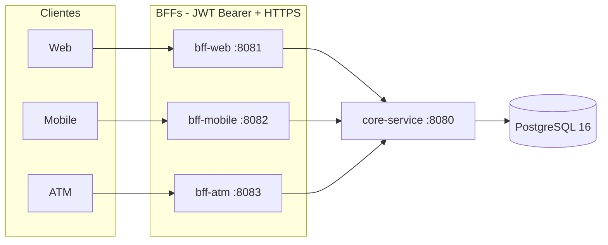

# XYZ Bank Server

Monorepo Java 21 / Spring Boot 3.5 de XYZ Bank: tres BFF por canal frente a un `core-service` interno. El seed de demo vive en Flyway de PostgreSQL.

## Objetivo

Exponer **una API distinta por canal** (web, mobile, ATM) sin que los clientes hablen con la base ni con el dominio interno.

- **Un BFF por canal.** Cada BFF agrega y recorta las respuestas de `core-service` según el ancho de banda y la necesidad del canal. Ningún BFF usa JPA ni tiene base de datos.
- **Un solo dueño de datos bancarios.** Solo `core-service` habla con PostgreSQL. Los BFF no usan JPA, Batch ni base propia.
- **Identidad y transporte reales.** Los BFF autentican con **JWT Bearer HS256 sobre HTTPS**. No hay fallback a `X-Customer-Id` / `X-Channel`. El rol del token (`ROLE_WEB`, `ROLE_MOBILE`, `ROLE_ATM`) debe coincidir con el canal.
- **Arquitectura hexagonal.** Use cases y DTOs en `application`; HTTP hacia core en `infrastructure`; ArchUnit impide que un BFF importe persistencia o el dominio de otro módulo.

Payloads actuales:


| Canal  | Puerto | Qué entrega                                                                                                                   |
| ------ | ------ | ----------------------------------------------------------------------------------------------------------------------------- |
| Web    | 8081   | Dashboard completo: perfil, saldo, últimos movimientos e intereses anuales. También historial filtrable e interés por cuenta. |
| Mobile | 8082   | Resumen ultraligero y plano: `accountId`, `balance`, `currency`. Sin historial ni metadatos.                                  |
| ATM    | 8083   | Saldo mínimo (`accountId`, `balance`, `currency`) y retiro idempotente.                                                       |


## Estructura

```
xyz_bank_server/
├── bff/
│   ├── bff-web/                 HTTPS :8081 — dashboard, historial, intereses
│   ├── bff-mobile/              HTTPS :8082 — summary plano
│   └── bff-atm/                 HTTPS :8083 — saldo y retiro
├── platform/
│   ├── core-domain/             Entidades y reglas (sin Spring, sin HTTP)
│   ├── core-service/            HTTP :8080 — único dueño de PostgreSQL
│   └── shared-security/         JWT, CallerContext, filtro de autenticación
├── data-migration/              Fuera del reactor (Batch, no forma parte del runtime BFF)
├── docs/
│   ├── architecture.md
│   └── contracts/               OpenAPI por servicio (fuente de verdad)
├── scripts/                     Keystore PKCS12 de desarrollo
├── docker-compose.yml           Stack completo
└── pom.xml                      Reactor Maven
```

Cada BFF sigue el mismo corte hexagonal:

```
…/{feature}/application/dto|ports|usecases
…/{feature}/infrastructure/adapters|rest
…/{feature}/config
…/shared/…                       correlación, cliente HTTP a core, errores
```




Contratos: `[docs/contracts/](docs/contracts/)`. Arquitectura: `[docs/architecture.md](docs/architecture.md)`.

## Instrucciones de ejecución


### Prerrequisitos

- Java 21
- Docker Desktop (o un daemon Docker compatible) con Compose v2
- Maven 3.9+ (en Windows, el Maven embebido de NetBeans también sirve)


### Stack completo (recomendado)

Desde la raíz del repositorio:

```bash
docker compose up --build
```


| Servicio      | Puerto     | Rol                                     |
| ------------- | ---------- | --------------------------------------- |
| PostgreSQL 16 | 5432       | Datos de `core-service` (Flyway + seed) |
| core-service  | 8080 HTTP  | API interna de dominio                  |
| bff-web       | 8081 HTTPS | Dashboard, historial e intereses        |
| bff-mobile    | 8082 HTTPS | Resumen aplanado de cuenta              |
| bff-atm       | 8083 HTTPS | Saldo y retiro                          |


`core-service` espera a PostgreSQL sano. Los BFF esperan a que `core-service` reporte `/actuator/health` en UP.

El certificado de 8081–8083 es autofirmado (`scripts/generate-dev-keystore.ps1` / `.sh`). Health y OpenAPI no requieren token.

```bash
docker compose down      # apagar
docker compose down -v   # apagar y borrar volúmenes (incluye el seed de demo)
```


### Datos de demo

Tras un arranque limpio, PostgreSQL contiene un cliente y una cuenta fijos (Flyway `V6__seed_demo_data.sql`).


| Recurso              | Valor                                  |
| -------------------- | -------------------------------------- |
| Cliente              | `11111111-1111-1111-1111-111111111111` |
| Cuenta               | `22222222-2222-2222-2222-222222222222` |
| Número de cuenta     | `1000000001`                           |
| Resumen de intereses | año `2025`                             |


### Identidad (JWT)

Los tres BFF exigen `Authorization: Bearer`. El secreto de desarrollo es `JWT_SECRET` (default `dev-only-change-me-use-32-chars-min`). Issuer `xyz-bank`. Algoritmo HS256.


| Claim         | Uso                                                                  |
| ------------- | -------------------------------------------------------------------- |
| `sub`         | Id del cliente                                                       |
| `channel`     | `web`, `mobile` o `atm`                                              |
| `roles`       | `ROLE_WEB`, `ROLE_MOBILE` o `ROLE_ATM` (debe coincidir con el canal) |
| `terminalId`  | Obligatorio si `channel=atm`                                         |
| `iss` / `exp` | `xyz-bank` y vencimiento                                             |


Cabeceras extra:


| Dato               | Quién lo envía | Uso                                                                                        |
| ------------------ | -------------- | ------------------------------------------------------------------------------------------ |
| `X-Terminal-Id`    | ATM            | Debe **coincidir exactamente** con el claim `terminalId` del JWT (403 si falta o no calza) |
| `Idempotency-Key`  | ATM en retiros | Reenvío seguro del mismo retiro                                                            |
| `X-Correlation-Id` | opcional       | Si falta, cada BFF genera un UUID y lo propaga a `core-service`                            |


`X-Customer-Id` / `X-Channel` **no** autentican. No hay login, OAuth2, mTLS ni PIN.

Token de desarrollo en PowerShell (1 hora, mismo secreto que el `application.yml`):

```powershell
function New-XyzBankJwt {
  param(
    [Parameter(Mandatory)][string]$Subject,
    [Parameter(Mandatory)][ValidateSet('web','mobile','atm')]$Channel,
    [string]$TerminalId = 'terminal-1',
    [string]$Secret = 'dev-only-change-me-use-32-chars-min'
  )
  function ConvertTo-Base64Url([byte[]]$Bytes) {
    [Convert]::ToBase64String($Bytes).TrimEnd('=').Replace('+','-').Replace('/','_')
  }
  $now = [DateTimeOffset]::UtcNow.ToUnixTimeSeconds()
  $role = 'ROLE_' + $Channel.ToUpper()
  $payload = [ordered]@{
    sub = $Subject; iss = 'xyz-bank'; iat = $now; exp = ($now + 3600)
    channel = $Channel; roles = @($role)
  }
  if ($Channel -eq 'atm') { $payload.terminalId = $TerminalId }
  $h = ConvertTo-Base64Url ([Text.Encoding]::UTF8.GetBytes('{"alg":"HS256","typ":"JWT"}'))
  $p = ConvertTo-Base64Url ([Text.Encoding]::UTF8.GetBytes(($payload | ConvertTo-Json -Compress)))
  $hmac = [System.Security.Cryptography.HMACSHA256]::new([Text.Encoding]::UTF8.GetBytes($Secret))
  $s = ConvertTo-Base64Url ($hmac.ComputeHash([Text.Encoding]::UTF8.GetBytes("$h.$p")))
  "$h.$p.$s"
}

$customer = '11111111-1111-1111-1111-111111111111'
$WEB_JWT    = New-XyzBankJwt -Subject $customer -Channel web
$MOBILE_JWT = New-XyzBankJwt -Subject $customer -Channel mobile
$ATM_JWT    = New-XyzBankJwt -Subject $customer -Channel atm -TerminalId terminal-1
```

En tests, el equivalente es `Hs256JwtFactory.devToken(...)`.

### Ejemplos de curl

`-k` acepta el certificado autofirmado.

**bff-web — dashboard** (perfil + saldo + historial + intereses)

```bash
curl -k -sS https://localhost:8081/customers/11111111-1111-1111-1111-111111111111/dashboard \
  -H "Authorization: Bearer $WEB_JWT"
```

**bff-mobile — resumen plano**

```bash
curl -k -sS https://localhost:8082/accounts/22222222-2222-2222-2222-222222222222/summary \
  -H "Authorization: Bearer $MOBILE_JWT"
```

**bff-atm — saldo y retiro**

```bash
curl -k -sS https://localhost:8083/accounts/22222222-2222-2222-2222-222222222222/balance \
  -H "Authorization: Bearer $ATM_JWT" \
  -H "X-Terminal-Id: terminal-1"

curl -k -sS -X POST https://localhost:8083/accounts/22222222-2222-2222-2222-222222222222/withdrawals \
  -H "Content-Type: application/json" \
  -H "Authorization: Bearer $ATM_JWT" \
  -H "X-Terminal-Id: terminal-1" \
  -H "Idempotency-Key: demo-withdrawal-1" \
  -d '{"amount":40.00,"currency":"USD"}'
```

Health y OpenAPI (sin token):

```bash
curl -sS http://localhost:8080/actuator/health
curl -k -sS https://localhost:8081/actuator/health
curl -k -sS https://localhost:8081/v3/api-docs
```


### Tests

```bash
# Unitarios y E2E (Testcontainers se omiten si no hay Docker)
mvn test

# Incluye tests de integración (`*IT`)
mvn verify

# Solo seguridad + los tres BFF
mvn -pl platform/shared-security,bff/bff-web,bff/bff-mobile,bff/bff-atm -am test
```

Los ITs de PostgreSQL usan Testcontainers. Sin Docker se omiten (`disabledWithoutDocker`) en lugar de fallar. Los tests de los BFF desactivan SSL (`server.ssl.enabled=false`).

### Troubleshooting

- **Puerto 5432 ocupado.** Otro Postgres local está usando el puerto. Debe estar libre, o baja el stack con `docker compose down` (eso no apaga bases de otros proyectos).
- **401 en los BFF.** Falta `Authorization: Bearer` o el JWT está mal firmado / vencido / con `iss` distinto de `xyz-bank`.
- **403 en los BFF.** Canal o rol incorrectos (un JWT `mobile` contra web, o `roles` que no calzan). En ATM, `X-Terminal-Id` ausente o distinto del claim `terminalId`.
- **El seed de demo desapareció o el dashboard da 404.** Flyway no reinserta filas de una versión ya aplicada. Reset: `docker compose down -v` y vuelve a `up --build`.
- **PostgreSQL cae con el stack ya arriba.** `GET http://localhost:8080/actuator/health` deja de reportar UP. Los BFF no tienen base propia: su health sigue UP aunque Postgres esté caído.
- **Testcontainers skipped.** Arranca Docker Desktop y vuelve a `mvn verify`.
- **502 Bad Gateway.** `core-service` respondió 5xx. El BFF no reenvía el body interno.
- **504 Gateway Timeout.** `core-service` no contestó dentro de 3s (tras los reintentos GET).


## Decisiones de Arquitectura y Resiliencia

Los BFF son el borde web del sistema. El stack de runtime es Spring Boot web + JWT + HTTPS. **Spring Batch no forma parte de ese borde:** `data-migration` queda fuera del reactor Maven y de Compose. El seed de cuentas vive en Flyway de PostgreSQL (`V6__seed_demo_data.sql`). El directorio `data-migration/` se conserva por si se necesita el job CSV de forma aislada.

Los tres BFF hablan con `core-service` con el mismo `RestClient` (no RestTemplate):

- Timeouts explícitos: 3s de conexión y 3s de lectura (`core-service.connect-timeout-ms` / `read-timeout-ms`).
- Retry con backoff exponencial solo en **GET**: máximo 3 intentos, 200ms × 2, tope 2s. Se reintenta I/O, timeout, 502, 503 y 504.
- **POST de retiro no se reintenta a nivel HTTP.** Un timeout a mitad de un retiro no debe duplicar el débito; el cliente ATM reenvía con el mismo `Idempotency-Key`.

Errores hacia el canal: `@RestControllerAdvice` + RFC 7807 (`application/problem+json`) con `title`, `status` y `detail`. Sin stack traces ni bodies internos de core.

- 404 de core → 404 `Not Found` (“The requested resource was not found”).
- 409 / 422 de core → mismo status (conflictos e fondos insuficientes en ATM).
- 5xx de core → 502 `Bad Gateway`.
- Timeout o conexión → 504 `Gateway Timeout`.

