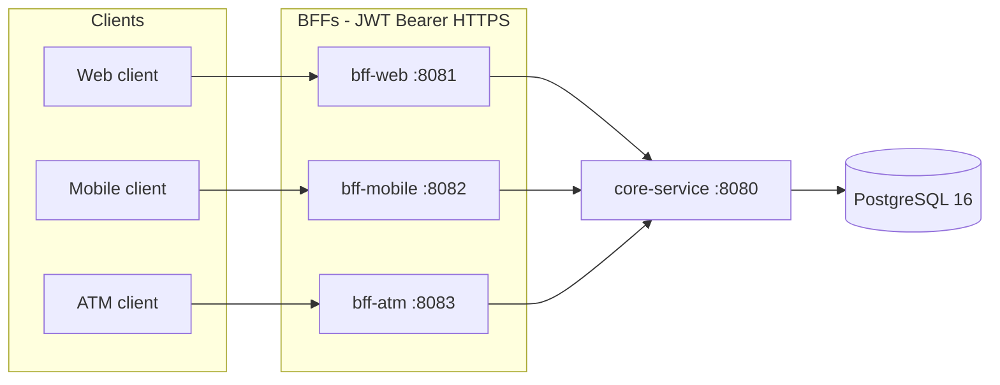
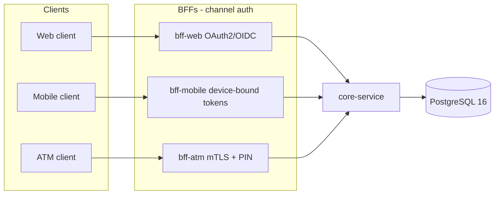

# Architecture

XYZ Bank exposes three channel-specific backends for frontend (BFFs) in front of a single internal `core-service`. Only `core-service` talks to PostgreSQL. Spring Batch and the legacy CSV job are out of the platform reactor and Compose runtime.

## Current topology

Caller identity is a **JWT Bearer token** validated in `shared-security`. Claims map to `CallerContext` (`sub`, `channel`, ATM `terminalId`). Identity headers are not accepted.

## Target topology

The BFF split and `core-service` boundary stay. What changes is how each channel proves who the caller is: OAuth2/OIDC for web, device-bound tokens for mobile, and mTLS plus PIN for ATM. The JWT `CallerContext` adapter is replaced; payload shapes, aggregation in the BFFs, and PostgreSQL as the only banking store do not.

What changes: the identity adapter in each BFF (JWT today, channel-native credentials later) and any edge TLS/mTLS termination. What does not change: one BFF per channel, `core-service` as the only database owner for banking entities, and the existing BFF payload contracts.
