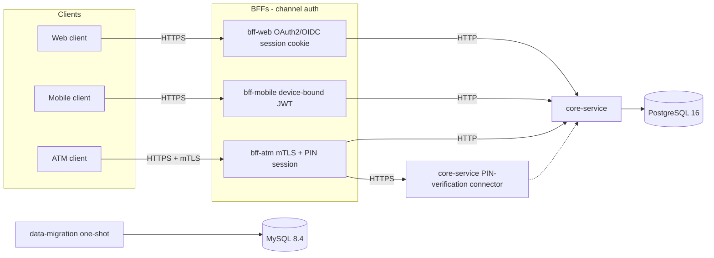

# Architecture

XYZ Bank exposes three channel-specific backends for frontend (BFFs) in front of a single internal `core-service`. Only `core-service` talks to PostgreSQL. The legacy CSV sanitization job writes reports to a separate MySQL instance; those reports are not loaded into core-service tables.

## Topology

Each channel proves who the caller is with a real credential instead of a trusted header: OAuth2/OIDC session cookie for web, a device-bound JWT for mobile, and mTLS plus a PIN-verified session for ATM. Every client-facing edge is TLS; the BFF→`core-service` edge stays plain HTTP except the one call that carries a raw PIN, which is TLS-only by design.

`core-service`'s PIN-verification connector (`CoreServicePin` above) is a second Tomcat connector on the same service, not a separate deployable — it shares `core-service`'s process and database access, drawn separately here only to show it terminates TLS while every other `core-service` endpoint stays plain HTTP.

What stays constant regardless of channel: one BFF per channel, `core-service` as the only database owner for banking entities, MySQL reserved for migration reports, and the existing BFF payload contracts. What each channel's credential proves and how it's validated is documented in `docs/contracts/*/openapi.yaml` and the `channel-auth`/`bff-web-auth`/`bff-mobile-auth`/`bff-atm-auth`/`channel-transport-security` specs under `openspec/`.
