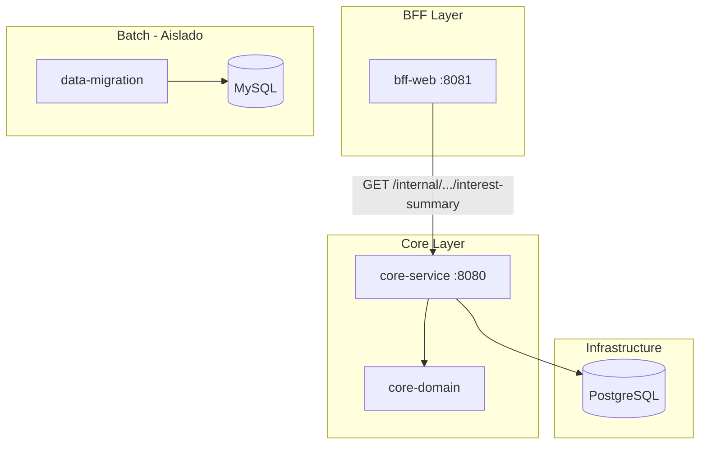

# FASE 1 — Auditoría del módulo "interests"

Fecha: 2026-09-16

## Resumen ejecutivo

El módulo `interests` en `core-service` es un módulo **de solo lectura** que expone un único endpoint para consultar resúmenes anuales de intereses por cuenta. No tiene lógica de cálculo ni jobs batch; los datos se cargan via seed de Flyway.

---

## 1. Ubicación del código

### En `platform/core-service`

```
src/main/java/cl/duoc/xyzbank/coreservice/interests/
├── application/
│   ├── dto/
│   │   └── AnnualInterestSummaryResponse.java
│   └── usecases/
│       └── GetAnnualInterestSummaryUseCase.java
├── config/
│   └── InterestsConfig.java
└── infrastructure/
    ├── persistence/
    │   ├── AnnualInterestSummaryJpaEntity.java
    │   ├── JpaInterestSummaryRepository.java
    │   └── SpringDataInterestSummaryRepository.java
    └── rest/
        └── InterestController.java
```

### En `platform/core-domain`

```
src/main/java/cl/duoc/xyzbank/coredomain/interests/
└── domain/
    ├── entities/
    │   └── AnnualInterestSummary.java
    └── repositories/
        └── InterestSummaryRepository.java
```

---

## 2. Endpoint expuesto

| Método | Path | Scope requerido |
|--------|------|-----------------|
| GET | `/internal/accounts/{accountId}/interest-summary?year={year}` | `web:interests:read` |

**Controlador:** [InterestController.java](../platform/core-service/src/main/java/cl/duoc/xyzbank/coreservice/interests/infrastructure/rest/InterestController.java)

```java
@GetMapping("/internal/accounts/{accountId}/interest-summary")
public AnnualInterestSummaryResponse getSummary(
        @PathVariable String accountId, @RequestParam(required = false) String year) {
    return getAnnualInterestSummaryUseCase.execute(accountId, year);
}
```

**Respuesta:**
```json
{
  "accountId": "uuid",
  "year": 2025,
  "openingBalance": 1000.00,
  "closingBalance": 1035.00,
  "interestRate": 0.0350,
  "interestAmount": 35.00,
  "currency": "USD"
}
```

---

## 3. Tabla tocada

**Tabla:** `annual_interest_summaries` (PostgreSQL)

**Migración:** [V4__create_annual_interest_summaries_table.sql](../platform/core-service/src/main/resources/db/migration/V4__create_annual_interest_summaries_table.sql)

```sql
CREATE TABLE annual_interest_summaries (
    id UUID PRIMARY KEY,
    account_id UUID NOT NULL REFERENCES accounts(id),
    year INT NOT NULL,
    opening_balance NUMERIC(19, 2) NOT NULL,
    closing_balance NUMERIC(19, 2) NOT NULL,
    interest_rate NUMERIC(6, 4) NOT NULL,
    interest_amount NUMERIC(19, 2) NOT NULL,
    currency VARCHAR(3) NOT NULL,
    UNIQUE (account_id, year)
);
```

**Dependencia de FK:** La tabla tiene una foreign key a `accounts(id)`. Esto significa que `interests-service` NO puede tener su propia base de datos sin romper la integridad referencial, o tendría que validar la existencia de la cuenta llamando a `core-service`.

---

## 4. Cómo se dispara hoy

| Mecanismo | Estado |
|-----------|--------|
| Job mensual / Scheduled | **NO existe** |
| Llamada directa HTTP | **SÍ** — desde bff-web |
| Cálculo automático | **NO existe** |
| Carga inicial | **Flyway seed** (V6__seed_demo_data.sql) |

**Hallazgo importante:** El módulo actual es **puramente de consulta**. No hay lógica para calcular intereses ni para crear/actualizar registros via API. El repositorio tiene método `save()` pero no está expuesto en ningún endpoint.

---

## 5. Dependencias identificadas

### 5.1 Consumidores (quien llama a interests)

#### bff-web → interestview

**Ruta del consumo:**
```
bff-web (8081)
  └── InterestViewController
        └── InterestViewUseCase
              └── InterestPort (interface)
                    └── HttpInterestAdapter (implementación)
                          └── RestClient → GET /internal/accounts/{accountId}/interest-summary
```

**Archivos afectados en bff-web:**
- [InterestViewController.java](../bff/bff-web/src/main/java/cl/duoc/xyzbank/bffweb/interestview/infrastructure/rest/InterestViewController.java)
- [InterestViewUseCase.java](../bff/bff-web/src/main/java/cl/duoc/xyzbank/bffweb/interestview/application/usecases/InterestViewUseCase.java)
- [InterestPort.java](../bff/bff-web/src/main/java/cl/duoc/xyzbank/bffweb/interestview/application/ports/InterestPort.java)
- [HttpInterestAdapter.java](../bff/bff-web/src/main/java/cl/duoc/xyzbank/bffweb/interestview/infrastructure/adapters/HttpInterestAdapter.java)
- [InterestViewConfig.java](../bff/bff-web/src/main/java/cl/duoc/xyzbank/bffweb/interestview/config/InterestViewConfig.java)

**Endpoint expuesto por bff-web:**
- `GET /accounts/{accountId}/interest-summary?year={year}` (HTTPS 8081)

### 5.2 Dominio compartido (core-domain)

El módulo `interests` en `core-service` depende de:

| Componente | Ubicación |
|------------|-----------|
| `AnnualInterestSummary` (entidad) | `core-domain/interests/domain/entities/` |
| `InterestSummaryRepository` (interface) | `core-domain/interests/domain/repositories/` |
| `Money` (value object) | `core-domain/accounts/domain/valueobjects/` |
| `Id` (value object) | `core-domain/shared/domain/` |
| `DomainException` | `core-domain/shared/domain/` |

### 5.3 Auth/Security

**En** [DomainEndpointScopes.java](../platform/core-service/src/main/java/cl/duoc/xyzbank/coreservice/auth/infrastructure/rest/DomainEndpointScopes.java):

```java
new Route(HttpMethod.GET, "/internal/accounts/*/interest-summary", Set.of("web:interests:read"))
```

El scope `web:interests:read` está hardcodeado. Durante la extracción hay que decidir si `interests-service` valida scopes o delega a un gateway.

### 5.4 data-migration (INDEPENDIENTE)

**Hallazgo crítico:** El módulo `monthlyinterests` en `data-migration` es **completamente independiente**:

- Usa Spring Batch para leer CSVs
- Escribe a **MySQL** (no PostgreSQL)
- Tiene su propia lógica de cálculo (`InterestRatePolicy`)
- NO llama ni depende del módulo `interests` de `core-service`
- NO afecta la tabla `annual_interest_summaries`

**Conclusión:** La extracción de `interests` a microservicio **no romperá** `data-migration`.

---

## 6. Diagrama de dependencias actuales



---

## 7. Riesgos identificados para la extracción

| Riesgo | Severidad | Mitigación |
|--------|-----------|------------|
| FK `accounts(id)` en tabla interests | Alta | interests-service debe validar cuenta via API a core-service antes de escribir |
| Scope `web:interests:read` hardcodeado | Media | Mover validación de scopes a gateway o replicar en interests-service |
| Dominio compartido en core-domain | Baja | Copiar entidades a interests-service o crear módulo shared |
| Sin endpoint de escritura actual | Info | Definir si interests-service expondrá POST/PUT o solo GET |

---

## 8. Preguntas para el Tech Lead (antes de Fase 2)

1. **¿interests-service tendrá su propia base de datos?**
   - Si sí: perderemos la FK a accounts, hay que validar por API
   - Si no: sigue siendo bounded context de core-service

2. **¿Se expondrá endpoint de creación/actualización de intereses?**
   - Actualmente solo existe GET
   - Si se requiere POST, hay que diseñar el flujo (¿quién calcula los intereses?)

3. **¿Cómo se poblarán los datos de intereses en producción?**
   - Hoy: Flyway seed
   - Futuro: ¿Job batch? ¿Evento de fin de año? ¿Manual?

---

## Próximos pasos

Esperando instrucciones del Tech Lead para:
- **FASE 2:** Diseño de la arquitectura del microservicio
- **FASE 3:** Plan de migración y estrategia de deploy
- **FASE 4:** Implementación con TDD
