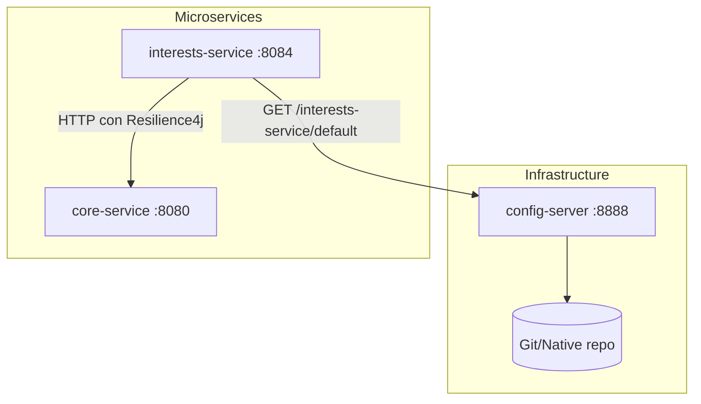
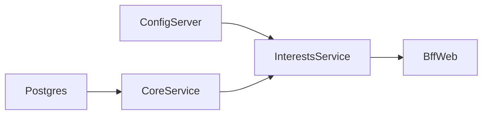

# FASE 2 — Config Server

Fecha: 2026-09-16

## Objetivo

Levantar un Spring Cloud Config Server que centralice la configuración de `interests-service`, separando lo que debe ser configurable en runtime (sin redeploy) de lo que es propio del servicio.

---

## 1. Arquitectura propuesta



---

## 2. Módulo `config-server`

### Ubicación en el reactor

```
xyz_bank_server/
├── platform/
│   ├── config-server/           ← NUEVO
│   │   ├── src/main/java/
│   │   ├── src/main/resources/
│   │   │   └── application.yml
│   │   ├── Dockerfile
│   │   └── pom.xml
│   ├── core-domain/
│   ├── core-service/
│   └── shared-security/
```

### Dependencias (pom.xml)

```xml
<dependencies>
    <dependency>
        <groupId>org.springframework.cloud</groupId>
        <artifactId>spring-cloud-config-server</artifactId>
    </dependency>
    <dependency>
        <groupId>org.springframework.boot</groupId>
        <artifactId>spring-boot-starter-actuator</artifactId>
    </dependency>
</dependencies>

<dependencyManagement>
    <dependencies>
        <dependency>
            <groupId>org.springframework.cloud</groupId>
            <artifactId>spring-cloud-dependencies</artifactId>
            <version>2024.0.0</version>
            <type>pom</type>
            <scope>import</scope>
        </dependency>
    </dependencies>
</dependencyManagement>
```

### Configuración (application.yml)

```yaml
server:
  port: 8888

spring:
  application:
    name: config-server
  profiles:
    active: native  # Para desarrollo local usamos filesystem
  cloud:
    config:
      server:
        native:
          search-locations: file:./config-repo
        # En producción cambiar a Git:
        # git:
        #   uri: https://github.com/xyzbank/config-repo
        #   default-label: main

management:
  endpoints:
    web:
      exposure:
        include: health
```

### Clase principal

```java
@SpringBootApplication
@EnableConfigServer
public class ConfigServerApplication {
    public static void main(String[] args) {
        SpringApplication.run(ConfigServerApplication.class, args);
    }
}
```

---

## 3. Repositorio de configuración

### Estructura del config-repo

```
config-repo/
├── interests-service.yml           # Configuración default
├── interests-service-dev.yml       # Override para perfil dev
└── interests-service-prod.yml      # Override para perfil prod
```

### Contenido de `interests-service.yml`

```yaml
# ══════════════════════════════════════════════════════════════════════════════
# Configuración centralizada de interests-service
# Cambios aquí se reflejan con POST /actuator/refresh (sin redeploy)
# ══════════════════════════════════════════════════════════════════════════════

core-service:
  base-url: http://localhost:8080
  connect-timeout-ms: 3000
  read-timeout-ms: 3000

# Resilience4j - Circuit Breaker
resilience4j:
  circuitbreaker:
    instances:
      coreServiceInterests:
        registerHealthIndicator: true
        slidingWindowSize: 10
        minimumNumberOfCalls: 5
        failureRateThreshold: 50
        waitDurationInOpenState: 30s
        permittedNumberOfCallsInHalfOpenState: 3
        automaticTransitionFromOpenToHalfOpenEnabled: true
  retry:
    instances:
      coreServiceInterests:
        maxAttempts: 3
        waitDuration: 500ms
        retryExceptions:
          - java.io.IOException
          - java.net.SocketTimeoutException
  timelimiter:
    instances:
      coreServiceInterests:
        timeoutDuration: 5s

# Logging level (ajustable sin redeploy)
logging:
  level:
    cl.duoc.xyzbank.interestsservice: INFO
    io.github.resilience4j: DEBUG
```

---

## 4. Configuración local vs centralizada

| Configuración | ¿Dónde vive? | Justificación |
|---------------|--------------|---------------|
| `server.port` | **Local** (application.yml) | Puerto es infraestructura del contenedor |
| `spring.application.name` | **Local** | Identidad del servicio, no cambia en runtime |
| `core-service.base-url` | **Centralizada** | Puede cambiar si core-service se mueve |
| `core-service.*-timeout-ms` | **Centralizada** | Tuning sin redeploy |
| `resilience4j.*` | **Centralizada** | Ajustar thresholds en producción sin redeploy |
| `logging.level.*` | **Centralizada** | Debug temporal sin redeploy |
| `management.*` | **Local** | Seguridad, no debe ser modificable remotamente |
| TLS/SSL config | **Local** | Secretos no van en config server |
| JWT secrets | **Local** (env vars) | Secretos nunca en config server |

---

## 5. Naming y `spring.config.import`

### Justificación del nombre `interests-service`

| Criterio | Valor | Justificación |
|----------|-------|---------------|
| `spring.application.name` | `interests-service` | Sigue convención kebab-case de Spring Cloud |
| Archivo en config-repo | `interests-service.yml` | Debe coincidir exactamente con application.name |
| Eureka serviceId | `INTERESTS-SERVICE` | Eureka lo convierte a uppercase |

### ¿bootstrap.yml o spring.config.import?

**Decisión: Usar `spring.config.import`** (no bootstrap.yml)

**Justificación:**
- `bootstrap.yml` está **deprecated** desde Spring Cloud 2020.0 (Ilford)
- Spring Boot 3.x usa `spring.config.import` como mecanismo estándar
- Es más explícito y no requiere dependencia adicional (`spring-cloud-starter-bootstrap`)

### Configuración en `interests-service` (application.yml local)

```yaml
server:
  port: 8084

spring:
  application:
    name: interests-service
  config:
    import: optional:configserver:http://localhost:8888
  cloud:
    config:
      fail-fast: false  # En dev, arranca aunque config-server no esté

management:
  endpoints:
    web:
      exposure:
        include: health,refresh
```

**Nota:** El prefijo `optional:` permite que el servicio arranque sin config-server en desarrollo local. En producción se remueve.

---

## 6. Refresh de configuración

Para aplicar cambios sin redeploy:

```bash
# Cambiar valor en config-repo/interests-service.yml
# Luego:
curl -X POST http://localhost:8084/actuator/refresh
```

Respuesta esperada:
```json
["resilience4j.circuitbreaker.instances.coreServiceInterests.waitDurationInOpenState"]
```

---

## 7. Docker Compose (adición)

```yaml
config-server:
  build:
    context: .
    dockerfile: platform/config-server/Dockerfile
  container_name: xyz-bank-config-server
  ports:
    - "8888:8888"
  volumes:
    - ./config-repo:/config-repo:ro
  healthcheck:
    test: ["CMD", "sh", "-c", "wget -qO- http://127.0.0.1:8888/actuator/health | grep -q UP"]
    interval: 10s
    timeout: 5s
    retries: 10
    start_period: 20s
```

---

## 8. Orden de arranque



1. `postgres` (healthcheck: pg_isready)
2. `config-server` (healthcheck: /actuator/health)
3. `core-service` (depends_on: postgres)
4. `interests-service` (depends_on: config-server, core-service)
5. BFFs (depends_on: interests-service si lo consumen)

---

## 9. Archivos a crear

| Archivo | Descripción |
|---------|-------------|
| `platform/config-server/pom.xml` | Módulo Maven |
| `platform/config-server/src/main/java/.../ConfigServerApplication.java` | Main class |
| `platform/config-server/src/main/resources/application.yml` | Config del server |
| `platform/config-server/Dockerfile` | Para Docker Compose |
| `config-repo/interests-service.yml` | Configuración centralizada |
| Modificar `pom.xml` raíz | Agregar módulo al reactor |
| Modificar `docker-compose.yml` | Agregar servicio |

---

## 10. Riesgos y mitigaciones

| Riesgo | Severidad | Mitigación |
|--------|-----------|------------|
| Config server caído | Alta | `optional:` prefix + defaults locales |
| Configuración incorrecta | Media | Validación en tests + /actuator/env |
| Secretos expuestos | Alta | Nunca poner JWT/passwords en config-repo |
| Latencia en startup | Baja | Config server es liviano (~2s startup) |

---

## Próximos pasos

Ver **FASE 3 — Service Discovery** para Eureka.
