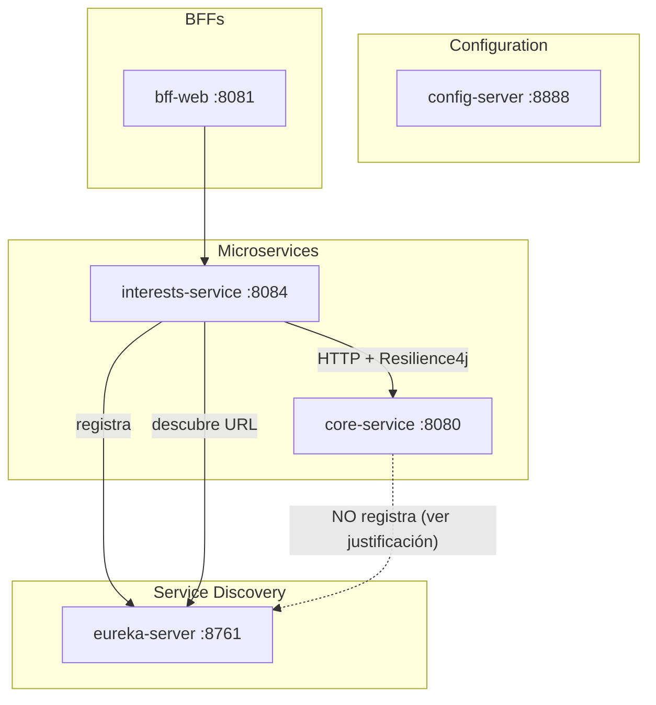
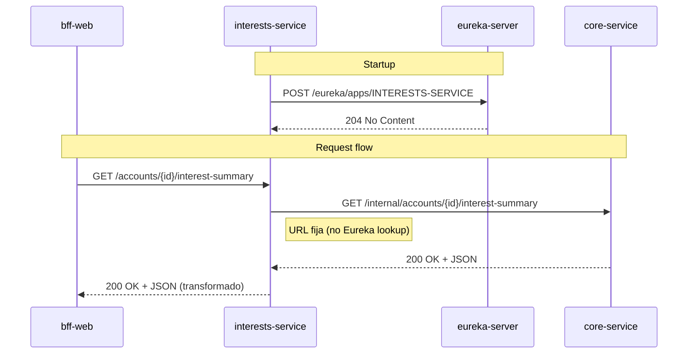
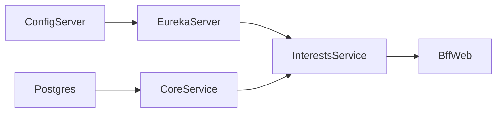

# FASE 3 — Service Discovery (Eureka)

Fecha: 2026-09-16

## Objetivo

Levantar un Eureka Server y registrar `interests-service` para habilitar descubrimiento dinámico. Evaluar si `core-service` también debe registrarse.

---

## 1. Arquitectura propuesta



---

## 2. Decisión crítica: ¿Registrar core-service en Eureka?

### Análisis

| Factor | Registrar | No registrar |
|--------|-----------|--------------|
| Descubrimiento dinámico | ✅ interests-service descubre core-service automáticamente | ❌ URL fija en config |
| Riesgo de romper producción | 🔴 **ALTO** — core-service ya funciona, modificarlo es riesgoso | 🟢 **BAJO** — no se toca core-service |
| Complejidad | Media — agregar dependencia eureka-client | Baja — solo config |
| Escalabilidad futura | ✅ Preparado para múltiples instancias | ❌ Load balancer externo necesario |
| Principio "no romper producción" | ❌ Viola el requerimiento | ✅ Respeta el requerimiento |

### Decisión: **NO registrar core-service en Eureka (por ahora)**

**Justificación:**

1. **El requerimiento dice explícitamente:** "Todo esto ya funciona en producción. No lo reescribas ni rompas su comportamiento actual."

2. **Agregar eureka-client a core-service implica:**
   - Nueva dependencia en pom.xml
   - Nueva configuración en application.yml
   - Potencial cambio en healthchecks
   - **Riesgo de regresión en los 4 módulos que ya consumen core-service** (bff-web, bff-mobile, bff-atm, y ahora interests-service)

3. **La URL de core-service es estable:**
   - En Docker Compose: `http://core-service:8080`
   - En Kubernetes: service DNS
   - No hay necesidad de descubrimiento dinámico para un servicio singleton

4. **Estrategia incremental:**
   - Fase actual: interests-service usa URL fija
   - Fase futura (si se necesita): registrar core-service cuando haya múltiples instancias

### Configuración resultante para interests-service

```yaml
# En config-repo/interests-service.yml
core-service:
  base-url: http://core-service:8080  # URL fija, no Eureka
```

---

## 3. Módulo `eureka-server`

### Ubicación en el reactor

```
xyz_bank_server/
├── platform/
│   ├── eureka-server/           ← NUEVO
│   │   ├── src/main/java/
│   │   ├── src/main/resources/
│   │   │   └── application.yml
│   │   ├── Dockerfile
│   │   └── pom.xml
│   ├── config-server/
│   ├── core-domain/
│   ├── core-service/
│   └── shared-security/
```

### Dependencias (pom.xml)

```xml
<dependencies>
    <dependency>
        <groupId>org.springframework.cloud</groupId>
        <artifactId>spring-cloud-starter-netflix-eureka-server</artifactId>
    </dependency>
    <dependency>
        <groupId>org.springframework.boot</groupId>
        <artifactId>spring-boot-starter-actuator</artifactId>
    </dependency>
</dependencies>

<dependencyManagement>
    <dependencies>
        <dependency>
            <groupId>org.springframework.cloud</groupId>
            <artifactId>spring-cloud-dependencies</artifactId>
            <version>2024.0.0</version>
            <type>pom</type>
            <scope>import</scope>
        </dependency>
    </dependencies>
</dependencyManagement>
```

### Configuración (application.yml)

```yaml
server:
  port: 8761

spring:
  application:
    name: eureka-server

eureka:
  instance:
    hostname: localhost
  client:
    register-with-eureka: false      # El server no se registra a sí mismo
    fetch-registry: false            # No necesita descargar el registry
    service-url:
      defaultZone: http://${eureka.instance.hostname}:${server.port}/eureka/
  server:
    enable-self-preservation: false  # En dev, desactivar para ver servicios caídos rápido
    eviction-interval-timer-in-ms: 5000

management:
  endpoints:
    web:
      exposure:
        include: health
```

### Clase principal

```java
@SpringBootApplication
@EnableEurekaServer
public class EurekaServerApplication {
    public static void main(String[] args) {
        SpringApplication.run(EurekaServerApplication.class, args);
    }
}
```

---

## 4. Registro de interests-service en Eureka

### Dependencia adicional en interests-service (pom.xml)

```xml
<dependency>
    <groupId>org.springframework.cloud</groupId>
    <artifactId>spring-cloud-starter-netflix-eureka-client</artifactId>
</dependency>
```

### Configuración en interests-service (application.yml local)

```yaml
server:
  port: 8084

spring:
  application:
    name: interests-service
  config:
    import: optional:configserver:http://localhost:8888

eureka:
  client:
    service-url:
      defaultZone: http://localhost:8761/eureka/
    register-with-eureka: true
    fetch-registry: true
  instance:
    prefer-ip-address: true
    lease-renewal-interval-in-seconds: 10
    lease-expiration-duration-in-seconds: 30
```

---

## 5. Flujo de comunicación



---

## 6. Dashboard de Eureka

Accesible en: `http://localhost:8761`

Mostrará:
- **INTERESTS-SERVICE** — 1 instancia UP
- (core-service NO aparece porque no está registrado)

---

## 7. Docker Compose (adiciones)

```yaml
eureka-server:
  build:
    context: .
    dockerfile: platform/eureka-server/Dockerfile
  container_name: xyz-bank-eureka-server
  ports:
    - "8761:8761"
  healthcheck:
    test: ["CMD", "sh", "-c", "wget -qO- http://127.0.0.1:8761/actuator/health | grep -q UP"]
    interval: 10s
    timeout: 5s
    retries: 10
    start_period: 30s

interests-service:
  build:
    context: .
    dockerfile: platform/interests-service/Dockerfile
  container_name: xyz-bank-interests-service
  ports:
    - "8084:8084"
  depends_on:
    config-server:
      condition: service_healthy
    eureka-server:
      condition: service_healthy
    core-service:
      condition: service_healthy
  environment:
    SPRING_CONFIG_IMPORT: configserver:http://config-server:8888
    EUREKA_CLIENT_SERVICE_URL_DEFAULTZONE: http://eureka-server:8761/eureka/
    CORE_SERVICE_BASE_URL: http://core-service:8080
  healthcheck:
    test: ["CMD", "sh", "-c", "wget -qO- http://127.0.0.1:8084/actuator/health | grep -q UP"]
    interval: 10s
    timeout: 5s
    retries: 10
    start_period: 30s
```

---

## 8. Orden de arranque actualizado



1. `postgres`
2. `config-server`
3. `eureka-server` (depends_on: config-server si también usa config centralizada)
4. `core-service` (depends_on: postgres)
5. `interests-service` (depends_on: config-server, eureka-server, core-service)
6. BFFs

---

## 9. Archivos a crear

| Archivo | Descripción |
|---------|-------------|
| `platform/eureka-server/pom.xml` | Módulo Maven |
| `platform/eureka-server/src/main/java/.../EurekaServerApplication.java` | Main class |
| `platform/eureka-server/src/main/resources/application.yml` | Config del server |
| `platform/eureka-server/Dockerfile` | Para Docker Compose |
| Modificar `pom.xml` raíz | Agregar módulo al reactor |
| Modificar `docker-compose.yml` | Agregar servicios |

---

## 10. ¿Cuándo registrar core-service en Eureka?

**Registrar core-service en Eureka cuando:**

- Se necesiten múltiples instancias de core-service (scaling horizontal)
- Se implemente un API Gateway (Spring Cloud Gateway)
- Se migre a Kubernetes con service mesh (en ese caso, Eureka ya no es necesario)

**Por ahora:** URL fija es suficiente y respeta el principio de no romper producción.

---

## 11. Resiliencia (adelanto de Fase 4)

Aunque interests-service NO usa Eureka para descubrir core-service, **sí usará Resilience4j** para tolerancia a fallos:

```java
@CircuitBreaker(name = "coreServiceInterests", fallbackMethod = "fallback")
@Retry(name = "coreServiceInterests")
@TimeLimiter(name = "coreServiceInterests")
public InterestSummaryResponse fetchFromCore(String accountId, String year) {
    return coreServiceClient.get()
        .uri("/internal/accounts/{accountId}/interest-summary?year={year}", accountId, year)
        .retrieve()
        .body(InterestSummaryResponse.class);
}

public InterestSummaryResponse fallback(String accountId, String year, Throwable t) {
    throw new ServiceUnavailableException("Interest service temporarily unavailable");
}
```

Configuración en `config-repo/interests-service.yml` (ya definida en Fase 2).

---

## 12. Riesgos y mitigaciones

| Riesgo | Severidad | Mitigación |
|--------|-----------|------------|
| Eureka caído | Media | interests-service cachea el registry; puede operar con last-known |
| Single point of failure | Media | En producción: Eureka cluster (peer-to-peer) |
| core-service no descubrible | Baja | URL fija es intencional; no es un riesgo |
| Latencia de registro | Baja | 30s para que Eureka vea el servicio UP |

---

## Próximos pasos

Esperando confirmación del Tech Lead para:
- **FASE 4:** Implementación de `interests-service` con Resilience4j
- **FASE 5:** Migración del consumo en bff-web (apuntar a interests-service en vez de core-service)
