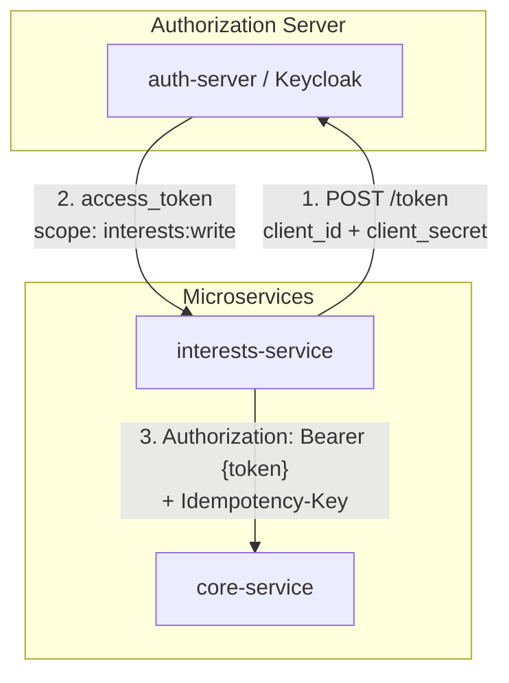
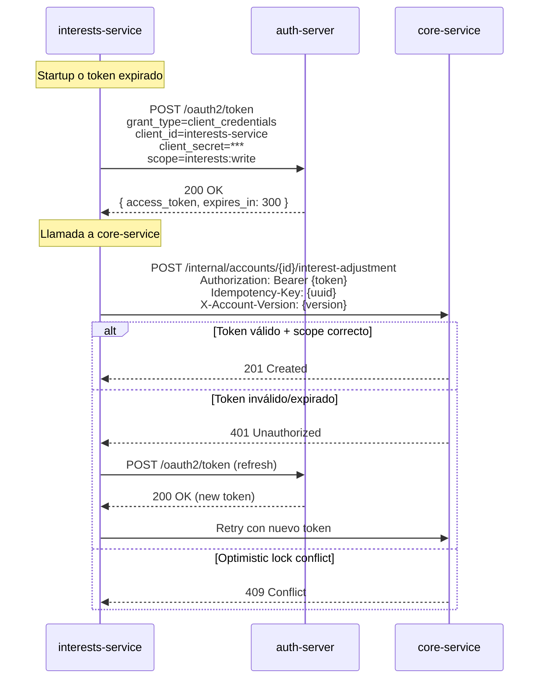
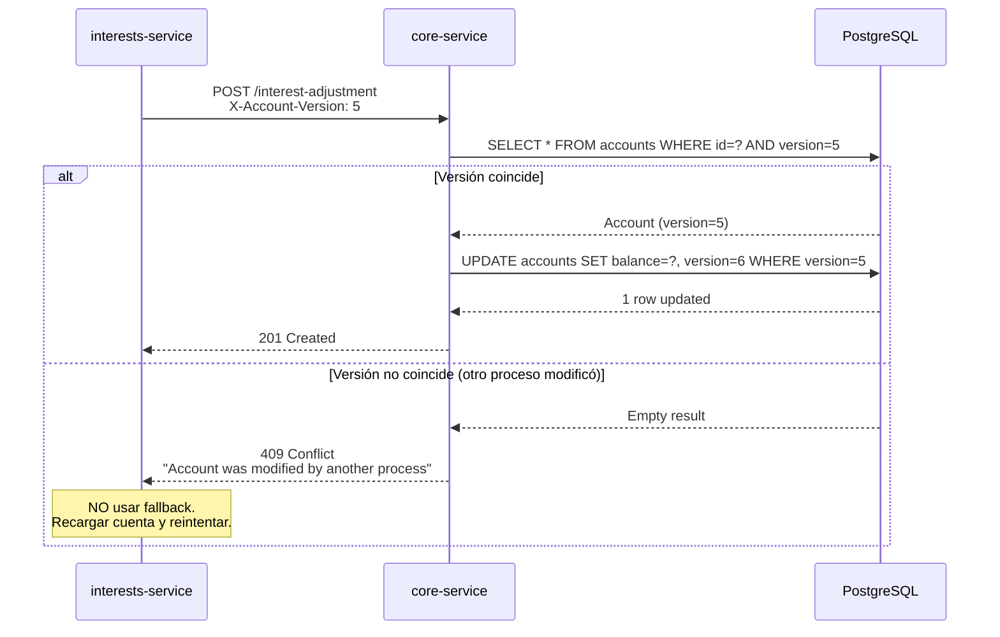
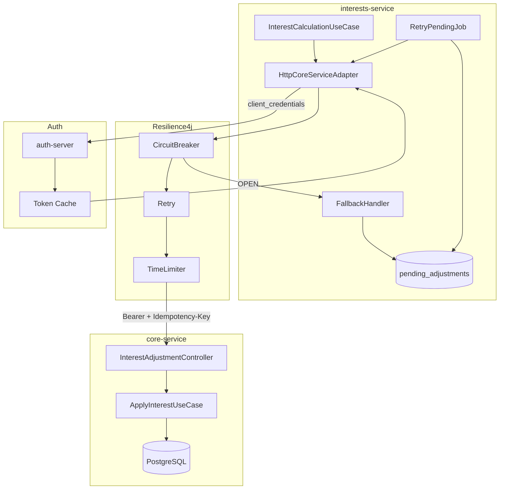

# FASE 4 — Tolerancia a fallos y autenticación

Fecha: 2026-09-16

## Objetivo

Diseñar la comunicación de `interests-service` hacia `core-service` con:
1. Circuit breaker + fallback (Resilience4j)
2. Autenticación service-to-service (OAuth 2.0 client credentials)
3. Respeto del Idempotency-Key y bloqueo optimista existente

---

## 1. Contexto: Estado actual de autenticación

### Mecanismo actual (NO OAuth2)

El sistema actual usa **headers estáticos** para autenticación service-to-service:

```yaml
# core-service/application.yml
security:
  service-credentials:
    web: dev-service-credential-web
    mobile: dev-service-credential-mobile
    atm: dev-service-credential-atm
```

```java
// EnforcementFilter.java
if (!isKnownServiceCredential(request.getHeader("X-Service-Credential"))) {
    reject(response, HttpStatus.UNAUTHORIZED, "A valid service credential is required");
}
```

### Problema

- Los credentials son **estáticos** (no rotan)
- No hay **scopes granulares** por operación
- Si un BFF es comprometido, tiene acceso a todo lo que su credential permite

---

## 2. Diseño: OAuth 2.0 Client Credentials

### Arquitectura propuesta



### Flujo detallado



### Configuración del cliente OAuth2

```yaml
# config-repo/interests-service.yml
spring:
  security:
    oauth2:
      client:
        registration:
          core-service:
            client-id: interests-service
            client-secret: ${INTERESTS_SERVICE_CLIENT_SECRET}
            authorization-grant-type: client_credentials
            scope: interests:write,interests:read
        provider:
          core-service:
            token-uri: ${AUTH_SERVER_URL:http://localhost:9000}/oauth2/token
```

### Scope dedicado

| Scope | Permite | Usado por |
|-------|---------|-----------|
| `interests:read` | GET /internal/accounts/{id}/interest-summary | bff-web (vía interests-service) |
| `interests:write` | POST /internal/accounts/{id}/interest-adjustment | Solo interests-service |

**Importante:** Este token es **independiente** de los tokens de sesión de los BFFs:
- Los BFFs usan tokens de usuario (JWT con `sub`, `channel`, `roles`)
- `interests-service` usa token de servicio (JWT con `client_id`, `scope`)
- **Nunca reutilizar** un token de canal para comunicación service-to-service

---

## 3. Diseño: Resilience4j

### Dependencias

```xml
<dependency>
    <groupId>io.github.resilience4j</groupId>
    <artifactId>resilience4j-spring-boot3</artifactId>
</dependency>
<dependency>
    <groupId>org.springframework.boot</groupId>
    <artifactId>spring-boot-starter-aop</artifactId>
</dependency>
```

### Configuración (en config-repo/interests-service.yml)

```yaml
resilience4j:
  circuitbreaker:
    instances:
      coreServiceInterests:
        registerHealthIndicator: true
        slidingWindowType: COUNT_BASED
        slidingWindowSize: 10
        minimumNumberOfCalls: 5
        failureRateThreshold: 50
        waitDurationInOpenState: 30s
        permittedNumberOfCallsInHalfOpenState: 3
        automaticTransitionFromOpenToHalfOpenEnabled: true
        recordExceptions:
          - java.io.IOException
          - java.net.SocketTimeoutException
          - org.springframework.web.client.ResourceAccessException
        ignoreExceptions:
          - cl.duoc.xyzbank.interestsservice.shared.domain.DomainException
  
  retry:
    instances:
      coreServiceInterests:
        maxAttempts: 3
        waitDuration: 500ms
        exponentialBackoffMultiplier: 2
        retryExceptions:
          - java.io.IOException
          - java.net.SocketTimeoutException
        ignoreExceptions:
          - cl.duoc.xyzbank.interestsservice.shared.domain.DomainException
  
  timelimiter:
    instances:
      coreServiceInterests:
        timeoutDuration: 5s
        cancelRunningFuture: true
```

### Implementación del adaptador

```java
@Component
public class HttpCoreServiceAdapter implements CoreServicePort {

    private final RestClient coreServiceClient;
    private final PendingAdjustmentRepository pendingAdjustmentRepository;

    @CircuitBreaker(name = "coreServiceInterests", fallbackMethod = "fallbackAdjustment")
    @Retry(name = "coreServiceInterests")
    @TimeLimiter(name = "coreServiceInterests")
    public InterestAdjustmentResponse adjustInterest(InterestAdjustmentRequest request) {
        return coreServiceClient.post()
            .uri("/internal/accounts/{accountId}/interest-adjustment", request.accountId())
            .header("Idempotency-Key", request.idempotencyKey())
            .header("X-Account-Version", String.valueOf(request.accountVersion()))
            .body(request)
            .retrieve()
            .body(InterestAdjustmentResponse.class);
    }

    /**
     * Fallback: NO perdemos el cálculo.
     * Guardamos el ajuste como PENDIENTE para reintento posterior.
     */
    public InterestAdjustmentResponse fallbackAdjustment(
            InterestAdjustmentRequest request, Throwable throwable) {
        
        PendingAdjustment pending = PendingAdjustment.create(
            Id.generate(),
            request.accountId(),
            request.amount(),
            request.idempotencyKey(),
            request.accountVersion(),
            throwable.getMessage()
        );
        
        pendingAdjustmentRepository.save(pending);
        
        log.warn("Interest adjustment queued for retry: accountId={}, idempotencyKey={}, reason={}",
            request.accountId(), request.idempotencyKey(), throwable.getMessage());
        
        // Retornamos respuesta indicando que está pendiente
        return InterestAdjustmentResponse.pending(
            request.accountId(),
            request.idempotencyKey(),
            "Adjustment queued for retry"
        );
    }
}
```

---

## 4. Fallback: Qué hace exactamente

### Escenarios de fallback

| Escenario | Acción del fallback | Recuperación |
|-----------|---------------------|--------------|
| core-service timeout | Guardar en `pending_adjustments` | Job de reintento |
| Circuit breaker OPEN | Guardar en `pending_adjustments` | Job de reintento |
| 5xx de core-service | Guardar en `pending_adjustments` | Job de reintento |
| 401/403 (auth) | **NO fallback** — propagar error | Configuración incorrecta |
| 409 Conflict (optimistic lock) | **NO fallback** — propagar error | Reintentar desde origen |
| 422 Validation | **NO fallback** — propagar error | Bug en interests-service |

### Tabla de ajustes pendientes

```sql
CREATE TABLE pending_adjustments (
    id UUID PRIMARY KEY,
    account_id UUID NOT NULL,
    amount NUMERIC(19, 2) NOT NULL,
    currency VARCHAR(3) NOT NULL,
    idempotency_key VARCHAR(64) NOT NULL UNIQUE,
    account_version BIGINT NOT NULL,
    failure_reason TEXT,
    retry_count INT DEFAULT 0,
    next_retry_at TIMESTAMP,
    status VARCHAR(20) DEFAULT 'PENDING',  -- PENDING, SUCCEEDED, FAILED_PERMANENT
    created_at TIMESTAMP DEFAULT CURRENT_TIMESTAMP,
    updated_at TIMESTAMP DEFAULT CURRENT_TIMESTAMP
);
```

### Job de reintento

```java
@Scheduled(fixedDelayString = "${interests.retry.interval:60000}")
public void retryPendingAdjustments() {
    List<PendingAdjustment> pending = pendingAdjustmentRepository
        .findByStatusAndNextRetryAtBefore(Status.PENDING, Instant.now());
    
    for (PendingAdjustment adjustment : pending) {
        try {
            coreServiceAdapter.adjustInterest(adjustment.toRequest());
            adjustment.markSucceeded();
        } catch (DomainException e) {
            // Error de negocio: no reintentar
            adjustment.markFailedPermanent(e.getMessage());
        } catch (Exception e) {
            // Error transitorio: programar siguiente reintento
            adjustment.incrementRetryAndScheduleNext();
        }
        pendingAdjustmentRepository.save(adjustment);
    }
}
```

**Garantía:** El cálculo de interés **nunca se pierde**. Si core-service falla, queda en cola para reintento.

---

## 5. Idempotency-Key y bloqueo optimista

### Confirmación: Se respeta el patrón existente

El sistema actual usa Idempotency-Key para withdrawals:

```java
// WithdrawAccountUseCase.java (existente)
Optional<Transaction> existing = transactionRepository.findByIdempotencyKey(request.idempotencyKey());
if (existing.isPresent()) {
    return replay(existing.get(), request);  // Idempotente: retorna resultado original
}
```

### Diseño para interest adjustments

```java
// Nuevo endpoint en core-service
@PostMapping("/internal/accounts/{accountId}/interest-adjustment")
public ResponseEntity<InterestAdjustmentResponse> adjustInterest(
        @PathVariable String accountId,
        @RequestHeader("Idempotency-Key") String idempotencyKey,
        @RequestHeader("X-Account-Version") long accountVersion,
        @RequestBody InterestAdjustmentRequest request) {
    
    // 1. Verificar idempotencia
    Optional<InterestAdjustment> existing = adjustmentRepository.findByIdempotencyKey(idempotencyKey);
    if (existing.isPresent()) {
        return ResponseEntity.ok(replay(existing.get()));
    }
    
    // 2. Cargar cuenta con versión específica
    Account account = accountRepository.findByIdAndVersion(accountId, accountVersion)
        .orElseThrow(() -> {
            // Versión no coincide = conflicto de bloqueo optimista
            if (accountRepository.existsById(accountId)) {
                throw DomainException.conflict("Account was modified by another process");
            }
            throw DomainException.notFound("Account not found");
        });
    
    // 3. Aplicar ajuste
    account.applyInterestAdjustment(request.amount());
    
    // 4. Persistir atómicamente
    InterestAdjustment adjustment = InterestAdjustment.create(
        Id.generate(), accountId, request.amount(), idempotencyKey);
    adjustmentRepository.saveWithAccount(adjustment, account);  // @Transactional
    
    return ResponseEntity.status(HttpStatus.CREATED).body(toResponse(adjustment));
}
```

### Headers requeridos

| Header | Requerido | Propósito |
|--------|-----------|-----------|
| `Authorization: Bearer {token}` | Sí | OAuth2 service token con scope `interests:write` |
| `Idempotency-Key` | Sí | UUID único por ajuste, permite reintento seguro |
| `X-Account-Version` | Sí | Versión de la cuenta para bloqueo optimista |

### Flujo de conflicto optimista



---

## 6. Diagrama completo de la comunicación



---

## 7. Configuración final de interests-service

### application.yml (local)

```yaml
server:
  port: 8084

spring:
  application:
    name: interests-service
  config:
    import: optional:configserver:http://localhost:8888
  datasource:
    url: jdbc:postgresql://${DB_HOST:localhost}:5432/interests_pending
    # Solo para tabla pending_adjustments, NO datos de negocio

interests:
  retry:
    interval: 60000
    max-attempts: 10
```

### config-repo/interests-service.yml (centralizada)

```yaml
core-service:
  base-url: http://core-service:8080
  connect-timeout-ms: 3000
  read-timeout-ms: 3000

spring:
  security:
    oauth2:
      client:
        registration:
          core-service:
            client-id: interests-service
            client-secret: ${INTERESTS_SERVICE_CLIENT_SECRET}
            authorization-grant-type: client_credentials
            scope: interests:write,interests:read

resilience4j:
  # ... (configuración completa de circuitbreaker, retry, timelimiter)
```

---

## 8. Riesgos y mitigaciones

| Riesgo | Severidad | Mitigación |
|--------|-----------|------------|
| Token service expirado mid-request | Media | Spring Security refresh automático |
| pending_adjustments crece indefinidamente | Media | TTL + alertas en retry_count > 5 |
| Idempotency-Key duplicado por bug | Alta | UUID generado por interests-service, no por caller |
| Circuit breaker stuck OPEN | Media | Health indicator + alerta |
| Bloqueo optimista en ráfaga | Baja | Backoff exponencial en retries |

---

## Próximos pasos

Ver **FASE 5 — Desactivación del módulo original** para feature flags y detección de duplicidad.
