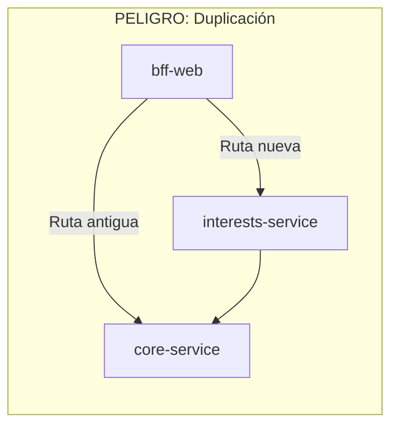
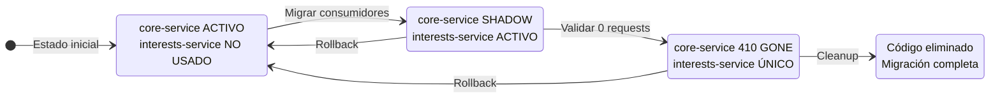

# FASE 5 — Desactivación del módulo original

Fecha: 2026-09-16

## Objetivo

Definir un feature flag para desactivar el módulo `interests` en `core-service` una vez que `interests-service` esté validado, evitando cálculos duplicados durante la migración.

---

## 1. Riesgo: Ambas rutas activas simultáneamente

### Escenario problemático



### Consecuencias

| Problema | Impacto | Ejemplo |
|----------|---------|---------|
| Doble lectura | Inconsistencia de datos | bff-web muestra interés de 2025 desde core-service, pero interests-service tiene datos actualizados |
| Doble escritura (futuro) | Corrupción de datos | Dos ajustes de interés aplicados a la misma cuenta |
| Confusión operacional | Debugging difícil | Logs muestran llamadas a ambos servicios |
| Desperdicio de recursos | Performance | Dos servicios procesando la misma lógica |

---

## 2. Estrategia: Feature Flags por fase

### Fases de migración

```mermaid
stateDiagram-v2
    [*] --> Fase0: Estado inicial
    Fase0 --> Fase1: Deploy interests-service
    Fase1 --> Fase2: Validar interests-service
    Fase2 --> Fase3: Migrar consumidores
    Fase3 --> Fase4: Desactivar core-service
    Fase4 --> [*]: Migración completa
    
    state Fase0 {
        core_service_enabled: true
        interests_service: NO EXISTE
    }
    
    state Fase1 {
        core_service_enabled: true
        interests_service_shadow: true
    }
    
    state Fase2 {
        core_service_enabled: true
        interests_service_primary: true
    }
    
    state Fase3 {
        core_service_enabled: false
        interests_service_primary: true
    }
    
    state Fase4 {
        core_service_module: ELIMINADO
        interests_service: ÚNICO
    }
```

---

## 3. Feature flag en core-service

### Configuración

```yaml
# core-service/application.yml
features:
  interests:
    enabled: ${FEATURE_INTERESTS_ENABLED:true}  # Default: activo (backward compatible)
    shadow-mode: ${FEATURE_INTERESTS_SHADOW:false}  # Log sin ejecutar
```

### Implementación del flag

```java
@Configuration
@ConfigurationProperties(prefix = "features.interests")
public class InterestsFeatureFlag {
    
    private boolean enabled = true;
    private boolean shadowMode = false;
    
    // getters, setters
    
    public boolean isActive() {
        return enabled && !shadowMode;
    }
    
    public boolean isShadowMode() {
        return enabled && shadowMode;
    }
    
    public boolean isDisabled() {
        return !enabled;
    }
}
```

### Aplicación en el controlador

```java
@RestController
public class InterestController {

    private final GetAnnualInterestSummaryUseCase useCase;
    private final InterestsFeatureFlag featureFlag;

    @GetMapping("/internal/accounts/{accountId}/interest-summary")
    public ResponseEntity<AnnualInterestSummaryResponse> getSummary(
            @PathVariable String accountId,
            @RequestParam(required = false) String year) {
        
        if (featureFlag.isDisabled()) {
            // Módulo desactivado: retornar 410 Gone
            return ResponseEntity.status(HttpStatus.GONE)
                .header("X-Deprecated-Endpoint", "Use interests-service instead")
                .build();
        }
        
        if (featureFlag.isShadowMode()) {
            // Shadow mode: log pero no ejecutar
            log.info("SHADOW_MODE: Interest request received but not processed. " +
                     "accountId={}, year={}", accountId, year);
            return ResponseEntity.status(HttpStatus.SERVICE_UNAVAILABLE)
                .header("X-Shadow-Mode", "true")
                .build();
        }
        
        // Modo activo normal
        return ResponseEntity.ok(useCase.execute(accountId, year));
    }
}
```

### Matriz de comportamiento

| `enabled` | `shadowMode` | Comportamiento |
|-----------|--------------|----------------|
| `true` | `false` | **Normal**: Procesa requests |
| `true` | `true` | **Shadow**: Log + 503 |
| `false` | `*` | **Desactivado**: 410 Gone |

---

## 4. Feature flag en bff-web (consumidor)

### Configuración

```yaml
# bff-web/application.yml
features:
  interests:
    use-interests-service: ${FEATURE_USE_INTERESTS_SERVICE:false}  # Default: usa core-service
```

### Router de intereses

```java
@Component
public class InterestServiceRouter implements InterestPort {

    private final HttpCoreServiceInterestAdapter coreServiceAdapter;
    private final HttpInterestsServiceAdapter interestsServiceAdapter;
    private final boolean useInterestsService;

    public InterestServiceRouter(
            HttpCoreServiceInterestAdapter coreServiceAdapter,
            HttpInterestsServiceAdapter interestsServiceAdapter,
            @Value("${features.interests.use-interests-service:false}") boolean useInterestsService) {
        this.coreServiceAdapter = coreServiceAdapter;
        this.interestsServiceAdapter = interestsServiceAdapter;
        this.useInterestsService = useInterestsService;
    }

    @Override
    public InterestViewResponse fetchSummary(String accountId, String year) {
        if (useInterestsService) {
            log.debug("Routing interest request to interests-service");
            return interestsServiceAdapter.fetchSummary(accountId, year);
        }
        log.debug("Routing interest request to core-service (legacy)");
        return coreServiceAdapter.fetchSummary(accountId, year);
    }
}
```

---

## 5. Detección de duplicidad

### 5.1 Logs estructurados

```java
// En core-service
@GetMapping("/internal/accounts/{accountId}/interest-summary")
public ResponseEntity<?> getSummary(...) {
    log.info("INTEREST_REQUEST source=core-service accountId={} year={} featureEnabled={}",
        accountId, year, featureFlag.isActive());
    // ...
}

// En interests-service
@GetMapping("/accounts/{accountId}/interest-summary")
public ResponseEntity<?> getSummary(...) {
    log.info("INTEREST_REQUEST source=interests-service accountId={} year={}",
        accountId, year);
    // ...
}
```

### 5.2 Query de detección (ELK/Splunk)

```
# Detectar si ambos servicios procesan la misma cuenta en ventana de 1 minuto
source=core-service OR source=interests-service
| stats count by accountId, source
| where count > 1
| alert "DUPLICATED_INTEREST_PROCESSING"
```

### 5.3 Métricas Prometheus

```java
// En ambos servicios
@Component
public class InterestMetrics {
    
    private final Counter requestsCounter;
    
    public InterestMetrics(MeterRegistry registry) {
        this.requestsCounter = Counter.builder("interests_requests_total")
            .tag("service", "${spring.application.name}")
            .tag("operation", "get_summary")
            .register(registry);
    }
    
    public void recordRequest() {
        requestsCounter.increment();
    }
}
```

### 5.4 Alerta de duplicidad

```yaml
# Prometheus alerting rule
groups:
  - name: interests-migration
    rules:
      - alert: DuplicateInterestProcessing
        expr: |
          sum(rate(interests_requests_total{service="core-service"}[5m])) > 0
          AND
          sum(rate(interests_requests_total{service="interests-service"}[5m])) > 0
        for: 5m
        labels:
          severity: warning
        annotations:
          summary: "Both core-service and interests-service are processing interest requests"
          description: "This indicates the migration is incomplete or misconfigured"
```

---

## 6. Plan de rollout

### Checklist por fase

#### Fase 1: Deploy interests-service (shadow mode)

```bash
# core-service: mantener activo
FEATURE_INTERESTS_ENABLED=true
FEATURE_INTERESTS_SHADOW=false

# interests-service: desplegado pero no consumido
# bff-web: sigue usando core-service
FEATURE_USE_INTERESTS_SERVICE=false
```

- [ ] Deploy interests-service
- [ ] Verificar health checks
- [ ] Verificar registro en Eureka
- [ ] Verificar conexión a config-server

#### Fase 2: Validar interests-service

```bash
# Pruebas manuales contra interests-service directamente
curl http://interests-service:8084/accounts/{id}/interest-summary?year=2025
```

- [ ] Respuestas idénticas a core-service
- [ ] Latencia aceptable (<500ms p99)
- [ ] Circuit breaker configurado correctamente
- [ ] Logs y métricas fluyendo

#### Fase 3: Migrar bff-web a interests-service

```bash
# bff-web: cambiar a interests-service
FEATURE_USE_INTERESTS_SERVICE=true

# core-service: activar shadow mode para detectar llamadas residuales
FEATURE_INTERESTS_ENABLED=true
FEATURE_INTERESTS_SHADOW=true
```

- [ ] Cambiar flag en bff-web
- [ ] Monitorear errores en bff-web
- [ ] Verificar que core-service NO recibe requests de interests
- [ ] Si hay requests a core-service en shadow → investigar origen

#### Fase 4: Desactivar módulo en core-service

```bash
# core-service: desactivar completamente
FEATURE_INTERESTS_ENABLED=false
```

- [ ] Desactivar flag
- [ ] Verificar 410 Gone si alguien llama al endpoint antiguo
- [ ] Alerta de duplicidad debe estar LIMPIA por 24h
- [ ] Documentar en runbook

#### Fase 5: Eliminar código (opcional, post-migración)

- [ ] Eliminar `interests/` de core-service
- [ ] Eliminar `InterestsFeatureFlag`
- [ ] Actualizar OpenAPI de core-service
- [ ] Archivar migraciones SQL relacionadas

---

## 7. Rollback plan

### Si interests-service falla en producción

```bash
# Paso 1: Revertir bff-web a core-service
FEATURE_USE_INTERESTS_SERVICE=false

# Paso 2: Reactivar core-service
FEATURE_INTERESTS_ENABLED=true
FEATURE_INTERESTS_SHADOW=false

# Paso 3: Investigar fallo en interests-service
```

### Tiempo estimado de rollback: <5 minutos
(Solo cambio de variables de entorno, sin redeploy)

---

## 8. Diagrama de estados del feature flag



---

## 9. Resumen de configuración final

### Variables de entorno por servicio

| Servicio | Variable | Fase 1 | Fase 2 | Fase 3 | Fase 4 |
|----------|----------|--------|--------|--------|--------|
| core-service | `FEATURE_INTERESTS_ENABLED` | true | true | true | **false** |
| core-service | `FEATURE_INTERESTS_SHADOW` | false | false | **true** | - |
| bff-web | `FEATURE_USE_INTERESTS_SERVICE` | false | false | **true** | true |
| interests-service | (siempre activo) | - | ✓ | ✓ | ✓ |

---

## 10. Riesgos y mitigaciones

| Riesgo | Severidad | Mitigación |
|--------|-----------|------------|
| Olvidar cambiar flag en algún BFF | Alta | Checklist + alerta de duplicidad |
| Rollback incompleto | Alta | Runbook con pasos exactos |
| Shadow mode oculta bugs | Media | Tests de integración antes de migrar |
| Código muerto en core-service | Baja | Ticket de cleanup post-migración |

---

## Próximos pasos

Con las 5 fases documentadas:
1. **Fase 1** — Auditoría ✅
2. **Fase 2** — Config Server ✅
3. **Fase 3** — Service Discovery ✅
4. **Fase 4** — Tolerancia y Autenticación ✅
5. **Fase 5** — Desactivación del módulo ✅

Esperando confirmación del Tech Lead para comenzar implementación con TDD.
